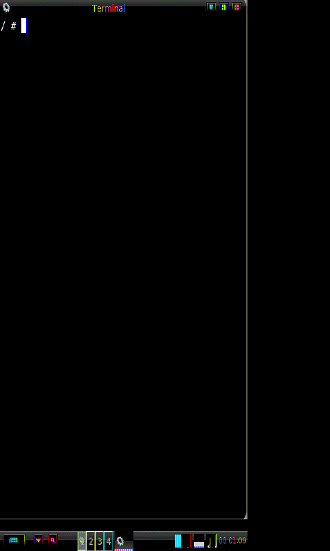

# postmarketOS на HTC HD2 — не тронув Windows Mobile

Телефон 2009 года. Внутри — заводская Windows Mobile 6.5, которую нельзя стирать.
Рядом, на microSD, живёт postmarketOS с ядром 3.0, рабочим столом, Wi-Fi и SSH.
За весь проект во внутреннюю память аппарата **не записано ни одного байта**.

<p align="center">
  
  <br>
  <sub>HTC HD2, холодная загрузка: 68 секунд до этого экрана — Wi-Fi, SSH и рабочий стол поднялись сами</sub>
</p>

```
Linux htc-leo 3.0.101 armv7l · QSD8250 Scorpion 1 ГГц · 448 МБ RAM · 480×800
```

---

## Что получилось

| | |
|---|---|
| **Загрузка** | стабильная, с первого раза — три патча ядра против «лотереи» |
| **Wi-Fi** | BCM4329, автоподключение, держит связь |
| **SSH** | вход по ключу, работает с первой минуты после загрузки |
| **Рабочий стол** | IceWM + тач, полноэкранный терминал, экранная клавиатура |
| **Цвета** | корректные во всех темах и иконках — два патча видеотракта |
| **Звук** | в наушниках (`beep h`) |
| **Периферия** | вибромотор, светодиоды, подсветка, батарея, часы |
| **Пакеты** | весь репозиторий Alpine прямо с телефона (`apk add …`) |

**Не работает** — и это честная стена, а не недоделка: динамик, Bluetooth-радио,
USB и модем. Все четыре упираются в одно: при запуске через HaRET радиопроцессор
остаётся спящим, а будит его только загрузчик в NAND (MAGLDR/cLK) — то есть ровно
то, чего мы не делаем.

---

## Семь патчей ядра

Главный технический результат. Каждый — про реальный дефект, найденный по логам,
а не подобранный наугад.

| № | Патч | Что чинит |
|---|---|---|
| 01 | `fix-compiler-path` | сборка ядра современным окружением |
| 02 | `vic-spurious-irq-0xffff` | шторм ложного прерывания `0xFFFF` в контроллере VIC |
| 03 | `gpio-clear-before-handler` | **зависание на старте**: `msm_init_gpio` включал обработчик GPIO-прерываний раньше, чем сбрасывал те, что оставила Windows Mobile |
| 04 | `rpcrouter-wince-kick` | попытка разбудить RPC-роутер модема (не помогла — см. «стена») |
| 05 | `drop-missing-msm_kexec` | `CONFIG_KEXEC` ломал сборку ссылкой на несуществующий файл |
| 06 | `fb-standard-rgb` | **цвета**: `msm_fb` объявлял нестандартный визуал `red@0` |
| 07 | `mdp-rgb-pack` | компенсация в MDP, чтобы физика совпала с новым визуалом |

Патчи 06 и 07 работают **только вместе**. По отдельности — либо перевёрнутые
иконки, либо перевёрнутый весь экран.

### История одного бага

`msm_init_gpio` устанавливал общий обработчик прерываний GPIO, и **только потом**
обнулял регистр разрешений и сбрасывал статус. Если Windows Mobile оставляла
висящее прерывание — обработчик срывался в бесконечный шторм, и ядро замирало
на четвёртой миллисекунде, ещё до вывода на экран.

Симптом выглядел как случайность: то грузится, то нет. Причина — в том, *чем
занималась WinMo перед запуском*. Нашлось включением `initcall_debug`: в журнале
осталось `calling msm_init_gpio` без парного `initcall … returned`. Патч
переставляет два действия местами — сброс до установки обработчика.

---

## Как это запускается

```
батарея → Windows Mobile → \PMOS\clrcad.exe → \PMOS\haret.exe
```

Дальше сама: Wi-Fi → DHCP → SSH → рабочий стол. Никаких действий не нужно.

```bash
ssh -i out/ssh/openwrt_key root@192.168.100.235
```

HaRET загружает ядро с карты прямо из-под Windows Mobile, ничего не переписывая.
Выключили — телефон снова обычный HD2 с WinMo.

---

## Устройство репозитория

```
docs/status.md      полная история: каждый баг, диагноз и лечение
docs/kernel-fixes.md разбор патчей ядра
out/*.patch         сами патчи
out/*.c             утилиты: beep (звук), fbswap, тесты видеотракта
scripts/            сборка ядра, развёртывание, диагностика
logs/               журналы и скриншоты — доказательная база
backup/pmos-config/ конфигурация работающей системы
```

Ядро собирается через `pmbootstrap` с патчами из `out/`; порт `htc-leo`
переведён в `archived`, поэтому кодовое имя вводится вручную, а сборка идёт
принудительно GCC 4 — с новыми компиляторами это ядро не стартует.

---

## Почему именно HaRET

Три загрузчика ведут себя по-разному, и только один совместим с задачей:

| Загрузчик | Трогает NAND | Windows Mobile после установки |
|---|---|---|
| **HaRET** | не трогает вообще | остаётся как есть ✅ |
| MAGLDR | переразмечает | стирается, нужна перепрошивка обратно |
| cLK | переразмечает | не остаётся, пункта загрузки нет |

Цена выбора — спящий радиопроцессор, отсюда и молчащий динамик. Это осознанный
размен: сохранность заводской системы против четырёх функций.

---

## Благодарности

Ядро — форк [qsd8k-legacy/android_kernel_htc_htcleo](https://github.com/qsd8k-legacy/android_kernel_htc_htcleo).
HaRET — [haret/haret](https://github.com/haret/haret). Ядро Android ICS для сравнения —
[tytung/android_kernel_htcleo-2.6.32](https://github.com/tytung/android_kernel_htcleo-2.6.32).
Дистрибутив — [postmarketOS](https://postmarketos.org/).

---

<sub>Аппарату шестнадцать лет. Он всё ещё умеет удивлять.</sub>
